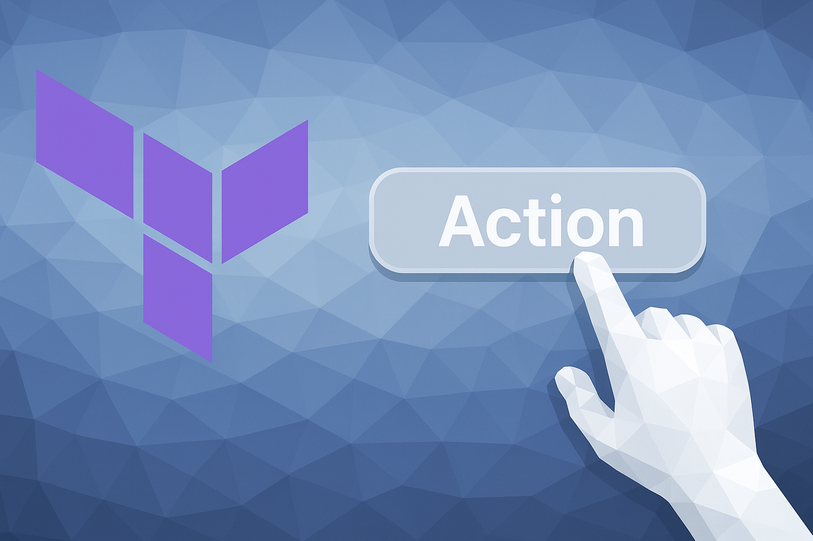

# HashiCorp User Group Göteborg 2025-11-18

Learn more about actions:

* [Terraform Actions: Deep-Dive](https://mattias.engineer/blog/2025/terraform-actions-deep-dive/)
* [Official documentation](https://developer.hashicorp.com/terraform/language/invoke-actions)

## Terraform Actions demo

Action shown during the demo at the event:

### AWS

* [ad-hoc](./actions/aws/ad-hoc/) - run actions as ad-hoc operations (`terraform apply -invoke action.<type>.<name>`)
* [CloudFront](./actions/aws/cloudfront/) - purge a CloudFront CDN cache
* [CodeBuild](./actions/aws/codebuild/) - start a CodeBuild project build run
* [DynamoDB](./actions/aws/dynamodb/) - take a backup of a DynamoDB table
* [Lambda](./actions/aws/lambda/) - invoke a Lambda function
* [Transcribe](./actions/aws/transcribe/) - start a transcribe job (speech-to-text)

### Azure

* [Front door](./actions/azure/frontdoor/) - purge an Azure Front Door cache
* [MSSQL](./actions/azure/sql/) - run a SQL-job